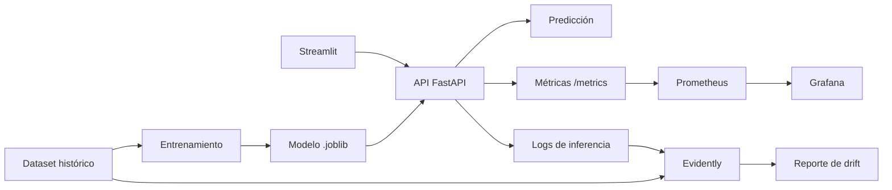

# Arquitectura del proyecto AndesLink Churn

## Objetivo del proyecto

Se busca armar un flujo MLOps completo para un caso de predicción de churn de clientes de una empresa ficticia llamada AndesLink Servicios Digitales S.A.

La idea no fue solamente entrenar un modelo, sino también dejarlo disponible mediante una API, poder probarlo desde una interfaz simple, contenerizar los servicios y agregar una primera capa de monitoreo.

El proyecto fue creciendo por etapas. Primero se trabajó sobre el análisis de datos y el entrenamiento del modelo. Después se incorporó el despliegue con FastAPI, Streamlit y Docker. En esta última etapa se sumó monitoreo técnico y monitoreo de datos/modelo.

## Estructura general

La arquitectura quedó organizada en varios componentes:

- dataset histórico de clientes;
- scripts de entrenamiento y evaluación;
- modelo entrenado guardado en `models/`;
- API desarrollada con FastAPI;
- interfaz web en Streamlit;
- logs de inferencias;
- métricas expuestas para Prometheus;
- dashboard en Grafana;
- reporte de drift generado con Evidently;
- despliegue local con Docker Compose.

El objetivo fue que cada parte tenga una responsabilidad clara. Por ejemplo, el entrenamiento está separado de la API, y la API no vuelve a entrenar el modelo: solamente carga el modelo ya guardado y lo usa para predecir.

## Flujo principal del sistema

El flujo general del proyecto es el siguiente:

En términos simples, el modelo se entrena una vez y se guarda. Luego la API lo carga y queda disponible para recibir datos de clientes. Cada vez que se consulta /predict, la API devuelve una predicción y además registra la inferencia en un archivo local.

## Entrenamiento del modelo

El entrenamiento se ejecuta desde:

src/train.py

En esta parte se carga el dataset, se separan las variables predictoras de la variable objetivo y se entrena el modelo.

Se probaron distintos modelos de clasificación y finalmente se eligió la regresión logística. Si bien no fue el modelo más complejo, resultó conveniente para este trabajo porque es más interpretable y suficiente para demostrar el flujo completo de MLOps.

El modelo final queda guardado en:

models/churn_model.joblib

Ese archivo es el que después consume la API.

## API con FastAPI

La API está en:

app/api/main.py

Los endpoints principales son:
| Endpoint   | Método | Uso                                                           |
| ---------- | -----: | ------------------------------------------------------------- |
| `/`        |    GET | Muestra información básica del servicio                       |
| `/health`  |    GET | Verifica si la API está funcionando y si el modelo cargó bien |
| `/predict` |   POST | Recibe datos de un cliente y devuelve la predicción           |
| `/metrics` |    GET | Expone métricas para Prometheus     

Para validar los datos de entrada se usan esquemas de Pydantic en:

app/api/schemas.py

Esto fue importante porque al principio era fácil mandar valores mal escritos o categorías que el modelo no esperaba. Con las validaciones, la API rechaza esos casos antes de llegar al modelo.

También se agregó un archivo de configuración:

app/api/config.py

Ahí quedaron centralizadas rutas, nombre del modelo, versión y umbrales de riesgo. Esto evita tener esos valores repetidos directamente en main.py.

## Respuesta del modelo

El endpoint /predict devuelve cuatro datos:                         |
{
  "prediction": 1,
  "churn_probability": 0.6788,
  "risk_level": "medio",
  "model_name": "logistic_regression"
}

La probabilidad se transforma además en un nivel de riesgo:
| Riesgo | Criterio usado       |
| ------ | -------------------- |
| Bajo   | menor a 0.40         |
| Medio  | entre 0.40 y 0.70    |
| Alto   | mayor o igual a 0.70 |
Esto se agregó para que la salida no sea solamente numérica. En un caso real, el área de negocio probablemente entendería mejor un nivel de riesgo que una probabilidad aislada.

## Logs de inferencia

Cada vez que se genera una predicción, la API guarda un registro en:
logs/predictions_log.csv

Ese archivo incluye la fecha de la predicción, el modelo utilizado, la probabilidad calculada, el nivel de riesgo y los valores de entrada.

Este log no se sube al repositorio porque es un archivo generado durante la ejecución. Igualmente se deja la carpeta logs/ con un .gitkeep para mantener la estructura.

La utilidad principal de este log es que después puede usarse como una ventana de datos actuales para comparar contra el dataset histórico.

## Monitoreo técnico

Para el monitoreo técnico se agregó Prometheus.

La API expone métricas en /metrics

Algunas métricas que se registran son:

-cantidad de requests;
-latencia;
-estado de carga del modelo;
-cantidad de predicciones;
-errores de inferencia;
-distribución de probabilidades de churn.

La configuración de Prometheus está en monitoring/prometheus/prometheus.yml

Prometheus consulta la API cada pocos segundos y guarda esas métricas.

## Dashboard en Grafana

Grafana se agregó para visualizar las métricas que recolecta Prometheus.

El dashboard quedó versionado en monitoring/grafana/dashboards/andeslink_api_monitoring.json

El dashboard muestra, entre otras cosas:

-si la API está disponible;
-si el modelo cargó correctamente;
-requests totales;
-latencia p95;
-predicciones totales;
-predicciones por clase;
-predicciones por nivel de riesgo;
-errores.

La idea del dashboard no es reemplazar un monitoreo productivo real, sino demostrar cómo se podría observar el comportamiento del servicio una vez desplegado.

## Monitoreo de datos con Evidently

Además del monitoreo técnico, se agregó un script para generar un reporte de drift con Evidently:

monitoring/evidently/generate_drift_report.py

Este reporte compara dos conjuntos de datos:

datos de referencia, tomados del dataset original;
datos actuales, tomados del log de inferencias cuando existen suficientes registros.

Cuando todavía no hay suficientes inferencias registradas, el script genera una ventana actual simulada. Esto permite mostrar el flujo de monitoreo aunque el proyecto no tenga tráfico real.

El reporte se guarda en reports/monitoring/evidently_drift_report.html

En un caso real, este reporte serviría para revisar si los datos que llegan al modelo empiezan a cambiar respecto de los datos con los que fue entrenado.

## Docker Compose

El sistema completo se levanta con Docker Compose.

Los servicios definidos son:
| Servicio     | Puerto | Descripción                 |
| ------------ | -----: | --------------------------- |
| `api`        |   8000 | API FastAPI                 |
| `streamlit`  |   8501 | Interfaz web                |
| `prometheus` |   9090 | Recolección de métricas     |
| `grafana`    |   3000 | Visualización del monitoreo |

El archivo principal es docker-compose.yml

Para levantar todo: docker compose up --build -d

Y para revisar el estado: docker compose ps

## Pruebas

Las pruebas están principalmente en tests/test_api.py

Se prueban casos como:
-que la API responda;
-que el modelo esté cargado;
-que /predict funcione con un payload válido;
-que la respuesta tenga los campos esperados;
-que se rechacen valores inválidos;
-que /metrics esté disponible.

Estas pruebas se pueden ejecutar con python -m pytest -v --disable-warnings

## Decisiones tomadas

Algunas decisiones del proyecto fueron:

-usar FastAPI porque genera documentación automática y permite validar datos;
-usar Streamlit porque permite probar el modelo sin depender solo de Swagger;
-usar Docker Compose porque facilita levantar varios servicios juntos;
-usar Prometheus y Grafana porque son herramientas comunes para monitoreo;
-usar Evidently para mostrar una primera aproximación al monitoreo de datos;
-mantener logs simples en CSV porque para este alcance no era necesario agregar una base de datos.

## Limitaciones

El proyecto funciona como una simulación local de un flujo MLOps. Todavía no incluye varios elementos que serían necesarios en producción, por ejemplo:

-autenticación;
-base de datos real para guardar inferencias;
-despliegue en cloud;
-alertas automáticas;
-reentrenamiento programado;
-CI/CD completo;
-monitoreo con tráfico real.

También hay una limitación importante: como el proyecto no tiene usuarios reales generando predicciones de forma continua, parte del monitoreo de datos se apoya en una ventana simulada.

## Conclusión

El proyecto permite recorrer un flujo MLOps de punta a punta: desde el entrenamiento del modelo hasta su despliegue local y monitoreo.
La parte más importante de esta última etapa fue agregar observabilidad. Ahora no solo se puede consultar el modelo, sino también revisar si la API responde, cuántas predicciones se hacen, si hay errores y si los datos actuales empiezan a diferir de los datos de referencia.